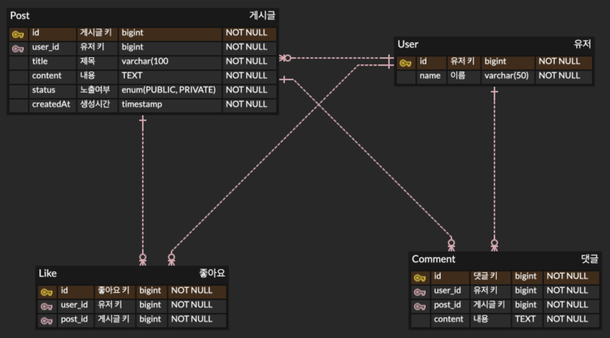

# 과제

### 추가 기능

- **유저가 만든 게시글 목록 조회**
    - 해당 유저가 db에 있는지 검증
    - PUBLIC, PRIVATE 상관없이 해당 유저가 작성한 모든 게시글 조회
- **댓글, 좋아요 기능 추가**
- **ERD 그리기**

  [ERDCloud](https://www.erdcloud.com/) 
  

---

### 상세 요구사항

- 게시글 조회 시 댓글도 불러오기
- 좋아요 처리/해제
- 같은 유저가 좋아요를 여러번 할 수 없음